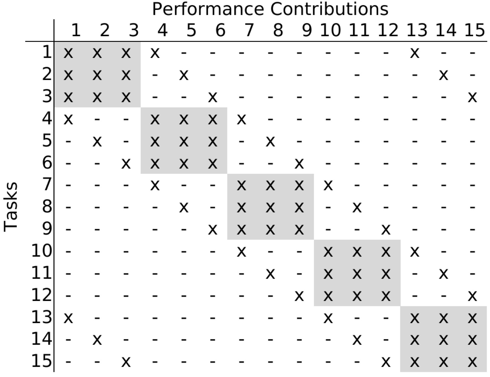
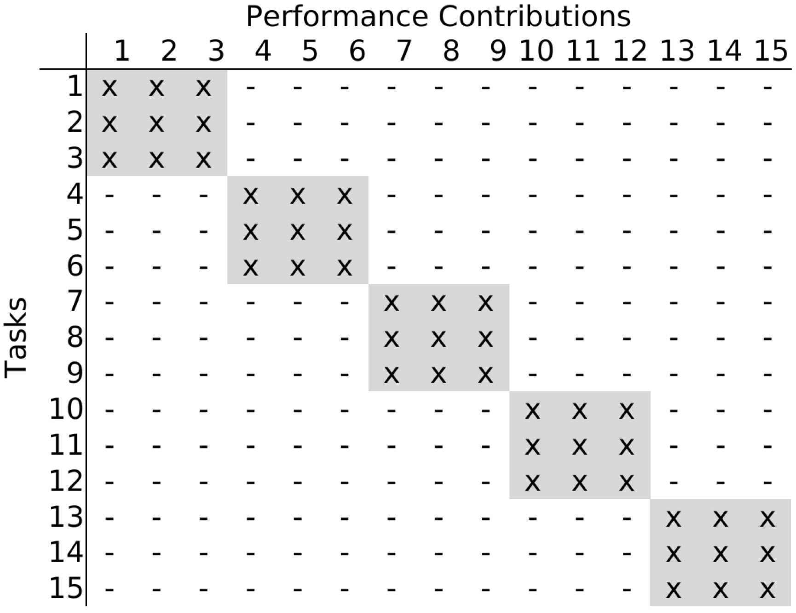
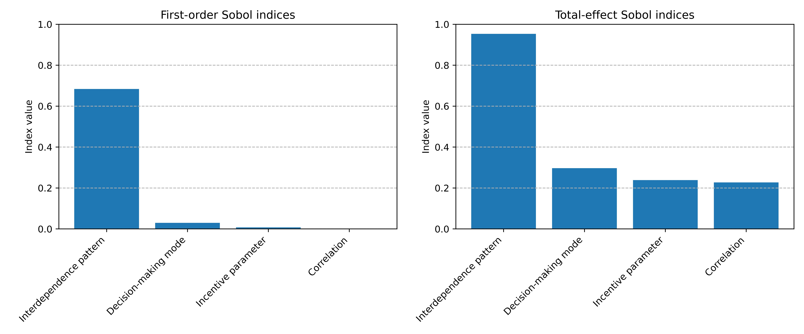

# SENSITIVITY  ANALYSIS

[ANALYSIS  OF  VARIANCE  STABILITY](#analysis-of-variance-stability)

1. [Fundamentals](#cov-fundamentals)

2. [Data and implementation](#cov-implementation)

3. [Parameter settings](#cov-parameters)

4. [Results](#cov-results)

5. [Interpretation of results](#cov-interpretation)

[VARIANCE-BASED  SENSITIVITY  ANALYSIS](#variance-based-sensitivity-analysis)

1. [Fundamentals](#vbsa-fundamentals)

2. [Data and implementation](#vbsa-implementation)

3. [Parameter settings](#vbsa-parameters)

4. [Results](#vbsa-results)

5. [Interpretation of results](#vbsa-interpretation)

[REFERENCES](#references)

# ANALYSIS  OF  VARIANCE  STABILITY

## Fundamentals 

To analyze the required number of repetitions of a simulation for the variance of the output to stabilize, the Coefficient of Variation ($c_v$) is employed [[1]](#1). The Coefficient of Variation is the ratio between the standard deviation of a sample ($\sigma$) and its mean ($\mu$):

$c_v = \frac{\sigma}{\mu}$ .

## Data and implementation 

The file [data_variance_stability.csv](../datasets/data_variance_stability.csv.zip) contains the simulation results for the scenarios analyzed, while the Python script for calculating the variation coefficients is located in [variance_stability.py](variance_stability.py). [data_variance_stability.csv](../datasets/data_variance_stability.csv.zip) is a zipped file, please download and unzip it to see the contents.

The contents of [data_variance_stability.csv](../datasets/data_variance_stability.csv.zip) are structured as follows: Each row corresponds to a single simulation run, with columns titled "matrix", "coordination", and "repetitions" detailing the simulation runs' parameter configurations. A summary of the parameters utilized is available [here](#cov-parameter-table), with a detailed explanation of how these parameters are mapped to the codes in [data_variance_stability.csv](../datasets/data_variance_stability.csv.zip) provided [here](#cov-mapping). The columns labeled from 0 to 499 track the performance over time, representing the performance recorded at each timestep during a specific simulation run.

To perform the analysis, open [variance_stability.py](variance_stability.py) and set the parameters `condition1` (filter for interdependence patterns), `condition2` (filter for decision-making modes), and `condition3` (filter for the number of simulation runs you are interested in), then run the script. The coding of parameters is explained [below](#cov-mapping). The Coefficient of Variation for the selected parameters will be displayed in the terminal window.

## Parameter settings 

To assess variance stability, the analysis varies parameters anticipated to induce the greatest variability in results. Specifically, it examines two distinct interaction patterns impacting landscape ruggedness, negatively correlated shocks, and four decision-making modes. In contrast, the incentive parameter remains fixed at 0.5, while the joint search probability is set at 0.2 in cases of collaborative decision-making. Decisions problems with a dimension of N=15 are considered.

### Summary of key parameters 

The following table summarizes the key parameters for the analysis of variance stability:

|Parameter                   |Notation     |Range                    |
|----------------------------|-------------|-------------------------|
|Repetitions                 |$R$          |{10, 50, 150, 250, 500, 750, 1,000}|
|Interdependence pattern     |--           |Reciprocal interdependencies   Small diagonal blocks|
|Decision-making mode        |--           |Decentral: Collaborative ($p$=0.2)   Decentral: Silo-based  Decentral: Sequential  Central|
|Correlation of schocks      |$\rho$       |-0.5
|Incentive parameter         |$\lambda$     |0.5 
|Dimensions in decision problem | $N$      |15
|Time-steps                  |$t$          |500
|Shock after $\tau$ periods  |$\tau$       |250

### Interdependence patterns

The interactions conform to the two patterns outlined below. In these patterns, rows represent decision making tasks, and columns represent performance contributions. In the matrix, "x" denotes an existing interdependency, while "-" indicates the absence of such interdependency. 

**Reciprocal interdependencies**

**Small diagonal blocks** 

### Mapping between parameters and codes used in provided data 

As previously stated, the analysis of variance stability varies based on the number of repetitions, the pattern of interdependence, and the mode of decision-making. The numbers for repetitions are taken directly from the [parameter table](#cov-parameter-table) and applied in [data_variance_stability.csv](../datasets/data_variance_stability.csv.zip). The coding for interdependence patterns and decision-making modes follows the scheme outlined in the table below.

|Parameter                   |Value        |Column in csv-file  |  Code used in csv-file 
|----------------------------|-------------|-------------------------|----|
|Interdependence pattern     |Reciprocal interdependencies   Small diagonal blocks      |matrix | 1   2
|Decision-making mode        |Decentral: Collaborative ($p$=0.2)   Decentral: Silo-based  Decentral: Sequential  Central| coordination | 1   2   3   4
|Repetitions                 |{10, 50, 150, 250, 500, 750, 1,000}| repetitions | {10, 50, 150, 250, 500, 750, 1,000}

## Results 

### Coefficients of Variation for scenarios with reciprocal interdependencies

|Decision-making mode               | R=10    | R=50    | R=150   | R=250   | R=500   | R=750   | R=1,000  | 
|-----------------------------------|---------|---------|---------|---------|---------|---------|----------| 
|Decentral: Silo-based	            |0.171	  |0.147	|0.146	  |0.138	|0.136	  |0.135	|0.139
|Decentral: Sequential	            |0.110	  |0.107	|0.101	  |0.095	|0.094	  |0.095	|0.098
|Decentral: Collaborative	        |0.136	  |0.125	|0.130	  |0.133	|0.131	  |0.132	|0.132
|Central	                        |0.105	  |0.100	|0.104	  |0.102	|0.104	  |0.102	|0.103

### Coefficients of Variation for scenarios with interdependencies in the pattern of small diagonal blocks

|Correlation of shocks              | R=10    | R=50    | R=150   | R=250   | R=500   | R=750   | R=1,000  |  
|-----------------------------------|---------|---------|---------|---------|---------|---------|----------|
|Decentral: Silo-based	            |0.066	  |0.055	|0.055	  |0.058	|0.058	  |0.059	|0.057
|Decentral: Sequential	            |0.070	  |0.057	|0.060	  |0.057	|0.056	  |0.057	|0.057
|Decentral: Collaborative	        |0.032	  |0.053	|0.053	  |0.054	|0.057	  |0.056	|0.056
|Central	                        |0.050	  |0.050	|0.056	  |0.055	|0.058	  |0.057	|0.056

## Interpretation of results 

The above-presented Coefficients of Variation suggest that the variability of the results predominantly falls within low to intermediate ranges. In terms of the number of repetitions needed for the Coefficient of Variation to achieve stability, the aim is to reach an epsilon (i.e., a difference in the coefficients of variation from one column to the next) of 0.01 or lower. The findings indicate that conducting 150 simulation repetitions is necessary for the coefficient of variation to stabilize. Therefore, this study will continue with a set number of 150 repetitions.

# VARIANCE-BASED  SENSITIVITY  ANALYSIS

## Fundamentals 

To analyze the sensitivity of the output of the simulation model to variations in the input parameters, the concept of a variance-based sensitivity analysis is employed. Such an analysis can help the researcher prioritize variables for further data collection, potentially leading to improved model accuracy and simplification of further analysis [[1]](#1). The variance-based sensitivity analysis does not assume linearity between input and output, decomposing variance into the isolated variance of a parameter and the variance coming from interactions with other parameters [[1](#1), [2](#2), [3](#3)].

The following explanation of the variance-based sensitivity analysis builds on the elaborations in [[4]](#4) and [[5]](#5). For simplicity, assume a simulation model takes the form of 

$Y = f(X_1, X_2, \dots, X_k)$ ,

where the variable $X_i$ indicates the $i^{th}$ input parameter.

### First-order effect index

The first-order Sobol index quantifies the direct contribution of each input variable $X_i$ to the variance of the output $Y$. It is important to note that the first-order Sobol index ignores interactions with other variables. It is defined as the ratio of the variance of the expected model output with respect to $X_i$ over the total variance of the model output:

$S_i = \frac{V_{X_i} (E_{\mathbf{X}_{\sim i}}(Y | X_i)) }{V(Y)}$ ,

where $X_i$ is the $i^{th}$ input variable, $\mathbf{X}_{\sim i}$ is the vector of all factors other than $i$. The inner expectation operator indicates the mean over all possible values of $\mathbf{X}_{\sim i}$, with $X_i$ fixed. The outer variance is computed over all possible values of $X_i$.

High values of the first-order index indicate that this variable alone (without any interactions with other variables) has a significant impact on the variability of the output $Y$. A low value, in contrast, indicates that this input variable (without any interactions) does not significantly contribute to output variability.

### Total-effect index

The total-effect Sobol index quantifies, for each input variable $X_i$, the total effect on the variance of the output $Y$. This includes its direct effect and all interaction effects. It is defined as

$S_{T_i} = 1 - \frac{V_{\mathbf{X}_{\sim i}} (E_{X_i} (Y | \mathbf{X}_{\sim i}))}{V(Y)}$ , 

where $V_{\mathbf{X}_{\sim i}}$ is the variance with respect to all variables except $X_i$ and $E_{X_i}$ is the conditional expectation of $X_i$. 

High values for the total-effect Sobol index indicate that the variable (either alone or in interaction with other input variables) considerably affects the variance of the output $Y$. A low value, instead, indicates that this input variable only has a marginal impact on the variance of the model output.

## Data and implementation 

The [data_sensitivity.csv](../datasets/data_sensitivity.csv.zip) file contains the simulated data used for conducting a variance-based sensitivity analysis, with the analysis script available in [sensitivity.py](sensitivity.py). [data_sensitivity.csv](../datasets/data_sensitivity.csv.zip) is a zipped file, please download and unzip it to see the contents.

This file's data organization is as follows: Each row pertains to an individual simulation run, with columns named "matrix", "coordination", "incentive", and "correlation" detailing the parameters configured for that particular simulation run. The mapping between the agent-based model's [parameters](#vbsa-parameter-table) and the ccodes used in [data_sensitivity.csv](../datasets/data_sensitivity.csv.zip) is detailed [here](#vbsa-mapping). The "fitness" column captures the mean performance (across all timesteps) for each simulation run.

The analysis leveraged the SALib library [[6]](#6) to generate 2^14 distinct parameter combinations. Data for the analysis was then sampled from [data_sensitivity.csv](../datasets/data_sensitivity.csv.zip). Using this data, functions from the SALib library were used to compute the first-order and total-effect Sobol indices.

To perform the analysis, run the script [sensitivity_analysis.py](sensitivity_analysis.py). This script reads the dataset from [data_sensitivity.csv](../datasets/data_sensitivity.csv.zip) and performs a variance-based sensitivity analysis. The first-order and total effect Sobol indices are displayed in the terminal window. Additionally, the script generates a plot of these indices and saves it as `sobol_indices.jpg`.

## Parameter settings 

 
|Parameter                   |Notation     |Range                    |
|----------------------------|-------------|-------------------------|
|Repetitions                 |$R$          |150 |
|Interdependence pattern     |--           |Reciprocal interdependencies   Small diagonal block|
|Correlation of schocks      |$\rho$       |\{-0.5, 0, 0.5\}|
|Decision-making mode        |--           |Decentral: Collaborative ($p$=0.1)   Decentral: Collaborative ($p$=0.2)   Decentral: Collaborative ($p$=0.3)   Decentral: Silo-based  Decentral: Sequential  Central|
|Incentive parameter         |$\lambda$     |\{0.25, 0.5, 0.75, 1\}|
|Dimensions in decision problem | $N$      |15
|Time-steps                  |$t$          |500
|Shock after $\tau$ periods  |$\tau$       |250

### Mapping between parameters and codes used in provided data 

The variance-based sensitivity analysis examines every possible combination of parameters as specified in the [parameter table](#vbsa-parameter-table), with the corresponding data available in [data_sensitivity.csv](../datasets/data_sensitivity.csv.zip). The mapping between the parameters and the codes used in the results file is detailed in the following table:

|Parameter                   |Value        |Column in csv-file | Code in csv-file 
|----------------------------|-------------|-------------------------|---|
|Interdependence pattern     |Reciprocal interdependencies   Small diagonal blocks      |matrix | 1   2
|Decision-making mode        |Decentral: Collaborative ($p$=0.1)   Decentral: Collaborative ($p$=0.2)   Decentral: Collaborative ($p$=0.3)   Decentral: Silo-based  Decentral: Sequential  Central|  coordination | 1   2   3   4   5   6
|Incentive parameter         |0.25  0.5  0.75  1 | incentive | 1  2  3  4 
|Correlation of schocks      |-0.5   0   0.5 | correlation | 1   2   3 

## Results 

The table and figure presented below contain the first-order and total-effect Sobol indices of the [parameters](#vbsa-parameter-table) evaluated in this variance-based sensitivity analysis.

|Parameter                   |First-order index        |Total-effect index
|----------------------------|-------------------------|------------------------
|Interdependence pattern     | 0.697                   | 0.965
|Decision-making mode        | 0.029                   | 0.303
|Incentive parameter         | 0.001                   | 0.241
|Correlation of schocks      | 0.002                   | 0.231

## Interpretation of results 

The first-order Sobol indices show the interdependence pattern's substantial direct influence on the performance measure's variability, whereas the impacts of other parameters are comparatively minor. Nonetheless, the total-effect Sobol indices reveal that the performance measure's variance is additionally affected by the decision-making mode, the incentive parameter, and the correlation of shocks, owing to their interactions with other parameters. The total-effect index for the interdependence pattern also shows an interaction effect. This suggests that a comprehensive understanding of the model's dynamics requires the inclusion of all parameters in the analysis. Therefore, the focus of the analysis will shift to exploring the interdependence pattern's first-order effect and the complex effects of the remaining parameters.

# REFERENCES

<a id="1">[1]</a> 
Lee, Ju-Sung, Tatiana Filatova, Arika Ligmann-Zielinska, Behrooz Hassani-Mahmooei, Forrest Stonedahl, Iris Lorscheid, Alexey Voinov, J. Gareth Polhill, Zhanli Sun, and Dawn C. Parker. "The complexities of agent-based modeling output analysis." Journal of Artificial Societies and Social Simulation 18, no. 4 (2015), DOI: [10.18564/jasss.2897](https://doi.org/10.18564/jasss.2897). 

<a id="2">[2]</a> 
Ligmann-Zielinska, Arika, and Libo Sun. "Applying time-dependent variance-based global sensitivity analysis to represent the dynamics of an agent-based model of land use change." International Journal of Geographical Information Science 24, no. 12 (2010): 1829-1850, DOI: [10.1080/13658816.2010.490533](https://doi.org/10.1080/13658816.2010.490533). 

<a id="3">[3]</a> 
Lilburne, Linda, and Stefano Tarantola. "Sensitivity analysis of spatial models." International Journal of Geographical Information Science 23, no. 2 (2009): 151-168, DOI: [10.1080/13658810802094995](https://doi.org/10.1080/13658810802094995). 

<a id="4">[4]</a> 
Saltelli, Andrea, Paola Annoni, Ivano Azzini, Francesca Campolongo, Marco Ratto, and Stefano Tarantola. "Variance based sensitivity analysis of model output. Design and estimator for the total sensitivity index." Computer Physics Communications 181, no. 2 (2010): 259-270, DOI: [10.1016/j.cpc.2009.09.018](https://doi.org/10.1016/j.cpc.2009.09.018). 

<a id="5">[5]</a> 
Sobol, Ilya M. "Global sensitivity indices for nonlinear mathematical models and their Monte Carlo estimates." Mathematics and Computers in Simulation 55, no. 1-3 (2001): 271-280, DOI: [10.1016/S0378-4754(00)00270-6](https://doi.org/10.1016/S0378-4754(00)00270-6). 

<a id="6">[6]</a> Herman, Jon, and Will Usher. "SALib: An open-source Python library for sensitivity analysis." Journal of Open Source Software 2, no. 9 (2017): 97, DOI: [10.21105/joss.00097](https://doi.org/10.21105/joss.00097).
